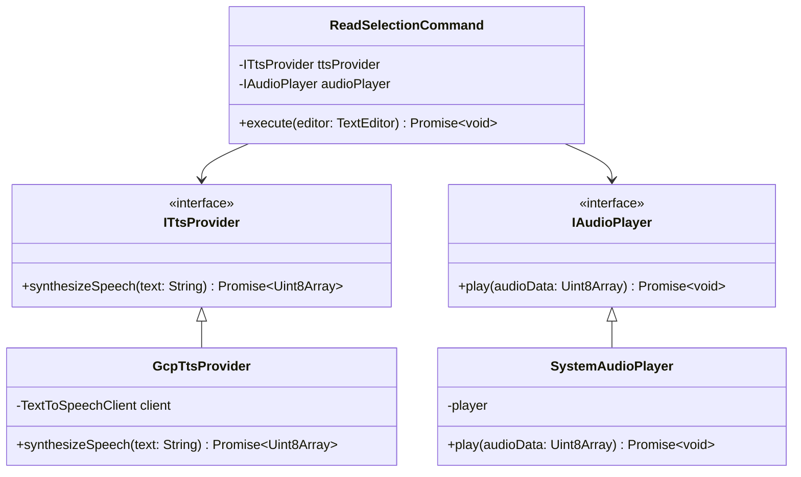

# Documentação Arquitetural: Anti-Gravity Gemini Voice Interface

## 1. Visão Geral

Este documento descreve a arquitetura da extensão Anti-Gravity Gemini Voice Interface. A solução converte texto selecionado em áudio via integração com Google Cloud TTS, operando dentro do Extension Host do VS Code. O projeto implementa os princípios de Clean Architecture (Ports and Adapters).

## 2. Diagrama de Casos de Uso

O diagrama abaixo mapeia as interações entre o Ator (Usuário do Editor) e o sistema.

```mermaid
usecaseDiagram
    actor Usuário as "Usuário (Dev)"
    
    package "Anti-Gravity Voice Extension" {
        usecase UC1 as "Acionar Leitura de Seleção"
        usecase UC2 as "Notificar Erro (Sem Seleção/Editor)"
        usecase UC3 as "Sintetizar Áudio"
        usecase UC4 as "Reproduzir Áudio"
    }
    
    actor GCP as "Google Cloud TTS (API)"
    actor SO as "Sistema Operacional (Áudio)"

    Usuário --> UC1
    UC1 ..> UC2 : <<extend>>
    UC1 ..> UC3 : <<include>>
    UC3 --> GCP
    UC3 ..> UC4 : <<include>>
    UC4 --> SO
```

## 3. Diagrama de Classes (UML)

A estrutura de classes demonstra a Inversão de Dependência. O domínio (`ReadSelectionCommand`) interage apenas com abstrações (`ITtsProvider` e `IAudioPlayer`).



## 4. Diagrama de Sequência

O fluxo de execução descreve o caminho dos dados desde o acionamento do comando até a limpeza de recursos.


## 5. Estratégia de Testes

Os testes validam o comportamento do domínio (`ReadSelectionCommand`), isolando a infraestrutura via *Mocks*. A suíte utiliza `Jest`.

* **Cobertura:** Casos de sucesso, tratamento de entradas inválidas (editor nulo, seleção vazia) e resiliência a falhas de API.
* **Complexidade:** Isolamento garante tempo de execução `O(1)` nas suítes e prevenção de requisições reais para APIs tarifadas.
