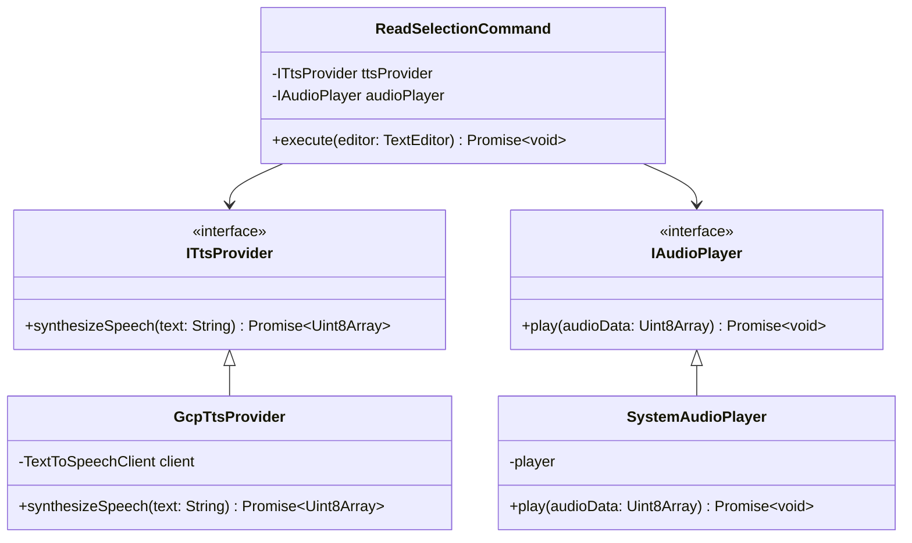
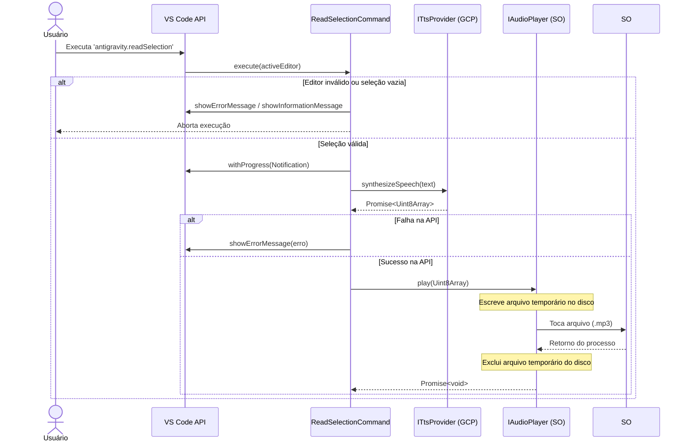

# Anti-Gravity Gemini Voice Interface

## 1. Visão Geral

Este documento descreve a arquitetura da extensão Anti-Gravity Gemini Voice Interface. A solução converte texto selecionado em áudio via integração com Google Cloud TTS, operando dentro do Extension Host do VS Code. O projeto implementa os princípios de Clean Architecture (Ports and Adapters).

## 2. Princípios de Arquitetura

A organização do código segue os seguintes princípios:

- **Separação de responsabilidades**: comando, provedores e reprodução de áudio ficam em camadas distintas.
- **Dependência de abstrações**: o domínio depende de interfaces, não de implementações concretas.
- **Infraestrutura isolada**: integração com Google Cloud TTS e player do sistema operacional fica concentrada em adaptadores.
- **Testabilidade**: o uso de interfaces e mocks permite testes unitários sem acesso real a APIs externas.

## 3. Diagrama de Casos de Uso

```mermaid
usecaseDiagram
    actor Usuário as "Usuário (Dev)"
    
    package "Anti-Gravity Voice Extension" {
        usecase UC1 as "Acionar Leitura de Seleção"
        usecase UC2 as "Notificar Erro (Sem Seleção/Editor)"
        usecase UC3 as "Sintetizar Áudio"
        usecase UC4 as "Reproduzir Áudio"
    }
    
    actor GCP as "Google Cloud TTS (API)"
    actor SO as "Sistema Operacional (Áudio)"

    Usuário --> UC1
    UC1 ..> UC2 : <<extend>>
    UC1 ..> UC3 : <<include>>
    UC3 --> GCP
    UC3 ..> UC4 : <<include>>
    UC4 --> SO
```

## 4. Diagrama de Classes (UML)



## 5. Fluxo de Execução



## 6. Estratégia de Testes

Os testes validam o comportamento do domínio (`ReadSelectionCommand`), isolando a infraestrutura por meio de mocks.

- **Cobertura**: cenários de sucesso, entrada inválida e falhas de API.
- **Objetivo**: garantir comportamento previsível sem depender de chamadas reais ao Google Cloud.
- **Ferramenta**: Jest.

## 7. Organização do repositório

```text
.
├── src/
├── docs/
│   └── architecture.md
├── __mocks__/
├── LICENSE.md
├── README.md
├── package.json
└── tsconfig.json
```

## 8. Licença

Este projeto está licenciado sob a MIT License. Consulte [`LICENSE.md`](../LICENSE.md) no repositório raiz.
