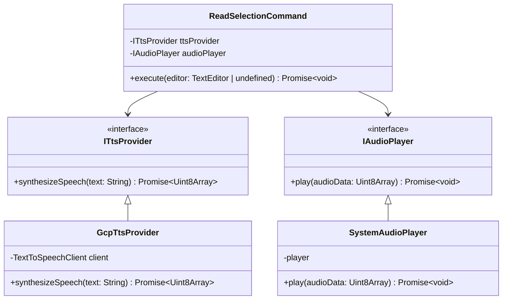
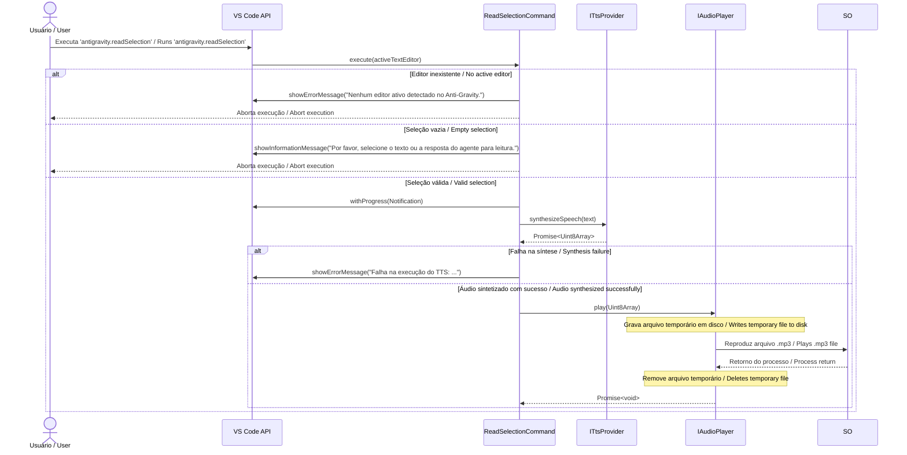

# Anti-Gravity Gemini Voice Interface / Interface de Voz Gemini Anti-Gravity

## 1. Visão Geral / Overview

Este documento descreve a arquitetura da extensão **Anti-Gravity Gemini Voice Interface**. A solução converte texto selecionado em áudio por meio de integração com **Google Cloud Text-to-Speech** e executa a reprodução no sistema operacional, dentro do ambiente do **VS Code**.

This document describes the architecture of the **Anti-Gravity Gemini Voice Interface** extension. The solution converts selected text into audio through **Google Cloud Text-to-Speech** integration and plays it back through the operating system, inside the **VS Code** environment.

A implementação segue uma organização inspirada em **Clean Architecture**, com o caso de uso central isolado de detalhes de infraestrutura como a API do Google e o mecanismo de reprodução de áudio.

The implementation follows a structure inspired by **Clean Architecture**, with the central use case isolated from infrastructure details such as the Google API and the audio playback mechanism.

## 2. Princípios de Arquitetura / Architecture Principles

A organização do código segue estes princípios:

- **Separação de responsabilidades**: o comando orquestra o fluxo; os serviços cuidam de síntese e reprodução.
- **Dependência de abstrações**: `ReadSelectionCommand` depende de interfaces (`ITtsProvider` e `IAudioPlayer`), não de implementações concretas.
- **Infraestrutura isolada**: a integração com o Google Cloud TTS e a reprodução via sistema operacional ficam concentradas em adaptadores.
- **Testabilidade**: a interface do caso de uso permite testes unitários com mocks, sem chamadas reais à API externa nem execução de áudio no ambiente local.

The code organization follows these principles:

- **Separation of concerns**: the command orchestrates the flow; services handle synthesis and playback.
- **Dependency on abstractions**: `ReadSelectionCommand` depends on interfaces (`ITtsProvider` and `IAudioPlayer`), not on concrete implementations.
- **Isolated infrastructure**: integration with Google Cloud TTS and operating-system playback is concentrated in adapters.
- **Testability**: the use case interface enables unit tests with mocks, without real external API calls or local audio playback.

## 3. Diagrama de Casos de Uso / Use Case Diagram

```mermaid
usecaseDiagram
    actor Usuário as "Usuário / User"
    
    package "Anti-Gravity Gemini Voice Interface" {
        usecase UC1 as "Acionar Leitura de Seleção / Trigger Selection Reading"
        usecase UC2 as "Notificar Erro / Notify Error"
        usecase UC3 as "Sintetizar Áudio / Synthesize Audio"
        usecase UC4 as "Reproduzir Áudio / Play Audio"
    }
    
    actor GCP as "Google Cloud TTS"
    actor SO as "Sistema Operacional / Operating System"

    Usuário --> UC1
    UC1 ..> UC2 : <<extend>>
    UC1 ..> UC3 : <<include>>
    UC3 --> GCP
    UC3 ..> UC4 : <<include>>
    UC4 --> SO
```

## 4. Diagrama de Classes / Class Diagram



## 5. Fluxo de Execução / Execution Flow



## 6. Estratégia de Testes / Testing Strategy

Os testes validam o comportamento do caso de uso `ReadSelectionCommand`, isolando as dependências de infraestrutura por meio de mocks.

The tests validate the behavior of the `ReadSelectionCommand` use case, isolating infrastructure dependencies through mocks.

- **Cobertura / Coverage**: cenários de sucesso, ausência de editor ativo, seleção vazia e falhas na síntese de áudio.
- **Objetivo / Goal**: garantir comportamento previsível sem depender da API do Google Cloud nem da reprodução real de áudio.
- **Ferramenta / Tool**: Jest.

## 7. Organização do repositório / Repository Structure

```text
.
├── src/
│   ├── commands/
│   │   └── readSelection.ts
│   ├── services/
│   │   ├── audioPlayer.ts
│   │   └── ttsProvider.ts
│   └── extension.ts
├── docs/
│   └── architecture.md
├── __mocks__/
├── package.json
└── tsconfig.json
```

## 8. Licença / License

Este projeto está licenciado sob a MIT License. Consulte [`LICENSE.md`](../LICENSE.md) no repositório raiz.

This project is licensed under the MIT License. See [`LICENSE.md`](../LICENSE.md) in the repository root.
